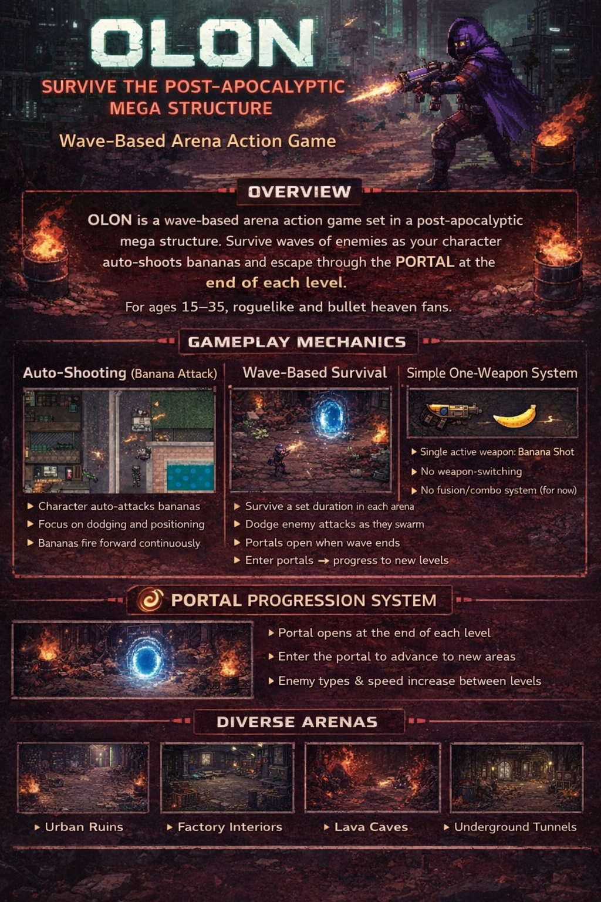
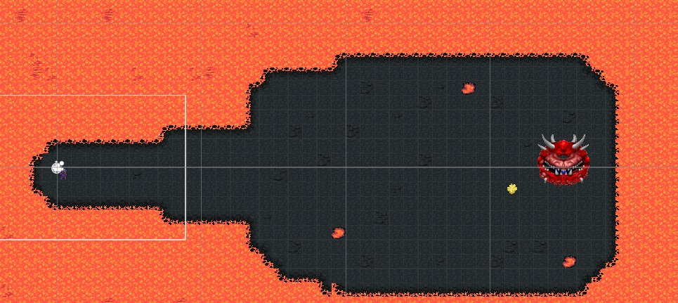

# OL0N - Web Sitesi

OL0N oyunu için profesyonel, modern web sitesi. GRO-7 Studio tarafından geliştirilen kıyamet sonrası roguelike survival oyununun resmi web sitesi.





## 🎮 Oyun Hakkında

**OL0N**, kıyamet sonrası mega yapıda geçen dalga tabanlı arena aksiyon oyunudur. Düşman dalgalarına karşı hayatta kal, karakterin otomatik olarak muz atışı yapar ve her seviyenin sonunda PORTAL'dan kaç.

**Hedef Kitle:** 15-35 yaş, roguelike ve bullet heaven hayranları için.

### Oyun Mekanikleri

- 🍌 **Otomatik Muz Atışı**: Karakter otomatik olarak muz atışı yapar. Sadece kaç ve konumlan!
- 🌊 **Dalga Tabanlı Hayatta Kalma**: Her arenada belirli süre hayatta kal, dalga bitince portal açılır
- 🔫 **Basit Tek Silah Sistemi**: Tek aktif silah - Muz Atışı. Silah değiştirme yok
- 🌀 **Portal İlerleme Sistemi**: Her seviyenin sonunda portal açılır, yeni alanlara ilerle
- 🏛️ **Çeşitli Arenalar**: Kentsel Harabeler, Fabrika İçleri, Lav Mağaraları, Yeraltı Tünelleri
- 🎯 **Odak: Hayatta Kalma**: Karmaşık sistemler yok, sadece saf hayatta kalma aksiyonu

## 🚀 Hızlı Başlangıç

### Yerel Geliştirme

1. Repository'yi klonlayın:
```bash
git clone https://github.com/Okkahai/0lon-Web.git
cd 0lon-Web
```

2. Basit bir HTTP sunucusu ile çalıştırın:

**Python ile:**
```bash
python -m http.server 8000
```

**Node.js ile:**
```bash
npx serve .
```

3. Tarayıcıda açın:
```
http://localhost:8000
```

## 📁 Proje Yapısı

```
0lon-Web/
├── index.html          # Ana HTML dosyası
├── styles.css          # CSS stilleri
├── script.js           # JavaScript dosyası
├── images/            # Oyun görselleri
│   ├── content.png    # Oyun poster görseli
│   ├── 0456314a-a6fc-44a2-84e9-30d2365bafdc.png
│   ├── 59264d11-28ba-4646-b429-6acf0d5fb310.png
│   └── 769a14ef-5de4-4cb5-8caa-0ad1f55766de.png
├── vercel.json         # Vercel deployment ayarları
├── package.json        # NPM paket bilgileri
├── .gitignore          # Git ignore dosyası
└── README.md           # Bu dosya
```

## 🎨 Teknolojiler

- **HTML5**: Semantik yapı
- **CSS3**: Modern stiller, animasyonlar, responsive tasarım
- **Vanilla JavaScript**: İnteraktif özellikler
- **Google Fonts**: Orbitron, Rajdhani fontları

## 🌐 Deployment

### GitHub Pages

1. GitHub'da repository → **Settings** → **Pages**
2. **Source:** "Deploy from a branch" → **Branch:** `main` → **Folder:** `/ (root)`
3. **Save**

Site: `https://okkahai.github.io/0lon-Web`

### Vercel (Önerilen)

1. [Vercel](https://vercel.com) hesabınıza giriş yapın
2. "New Project" butonuna tıklayın
3. GitHub repository'nizi import edin
4. Vercel otomatik olarak ayarları algılayacak
5. "Deploy" butonuna tıklayın

### GitHub Pages

1. Repository Settings'e gidin
2. Pages bölümüne gidin
3. Source olarak "main" branch'ini seçin
4. Save'e tıklayın

### Manuel Deployment

Dosyaları herhangi bir statik hosting servisine yükleyebilirsiniz:
- Netlify
- GitHub Pages
- Firebase Hosting
- AWS S3 + CloudFront

## 🎯 Özellikler

- ✅ Tam responsive tasarım (mobil, tablet, desktop)
- ✅ Modern, profesyonel görünüm
- ✅ Smooth animasyonlar
- ✅ Lightbox galeri
- ✅ SEO uyumlu
- ✅ Hızlı yükleme
- ✅ Cross-browser uyumluluk

## 👥 Geliştirici Ekip

**GRO-7 Studio**

- Gun Deniz
- Deniz Yalım Yılmaz
- Deniz Manav
- Emre Akar
- Yiğit Kay
- Burak Arda Özköse
- Oğuz Köylü

## 📝 Lisans

Bu proje GRO-7 Studio'ya aittir. Tüm hakları saklıdır.

## 🔗 Bağlantılar

- **Oyun Repository**: [GitHub](https://github.com/dnzmnv/0lon)
- **itch.io**: [Yakında](https://itch.io)
- **Web Oyun**: Unity WebGL ile tarayıcıda oynanabilir

## 📧 İletişim

Sorularınız için GitHub Issues kullanabilirsiniz.

---

**OL0N** - Kıyamet sonrası hayatta kalma mücadelesi. GRO-7 Studio © 2025
